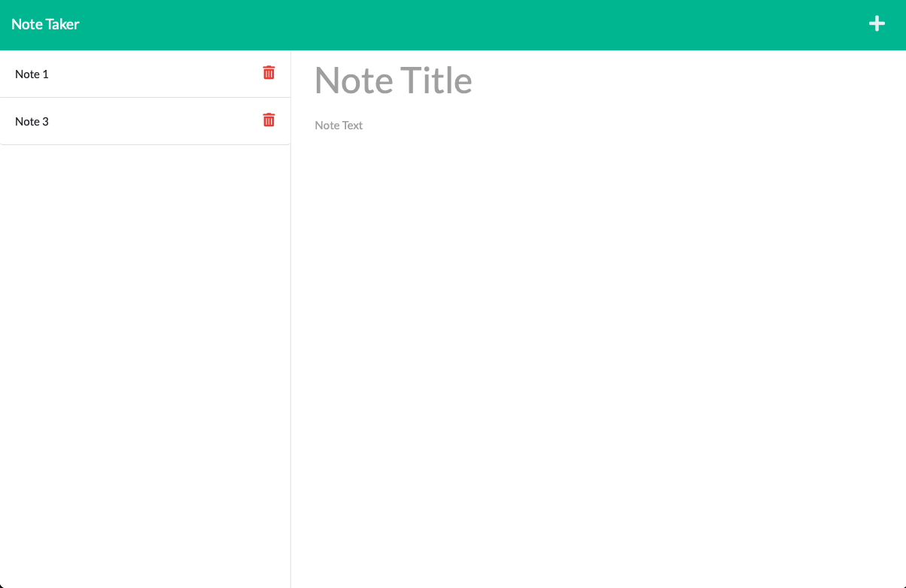

[](https://opensource.org/licenses/MIT)

<br />
<div align="center">
  <h3 align="center">note-taker</h3>

  <p align="center">
    This app can be used to write and save notes. This application will use an Express.js back end and will save and retrieve note data from a JSON file.
    <br/>
    ·
    <a href="https://github.com/heranyang93/note-taker/issues">Report Bug</a>
    ·
    <a href="https://github.com/heranyang93/note-taker/issues">Request Feature</a>

  </p>
</div>

<details>
  <summary>Table of Contents</summary>
  <ol>
    <li>
      <a href="#about-the-project">About The Project</a>
      <ul>
        <li><a href="#user-story">User Story</a></li>
        <li><a href="#acceptance-criteria">Acceptance Criteria</a></li>
        <li><a href="#built-with">Built With</a></li>
      </ul>
    </li>
    <li>
      <a href="#getting-started">Getting Started</a>
    </li>
    <li><a href="#usage">Usage</a></li>
    <li><a href="#license">License</a></li>
    <li><a href="#contact">Contact</a></li>
  </ol>
</details>

## About The Project



This is an application called Note Taker that can be used to write and save notes. This application will use an Express.js back end and will save and retrieve note data from a JSON file.

<p align="right">(<a href="#top">back to top</a>)</p>

### User Story

```md
AS A small business owner
I WANT to be able to write and save notes
SO THAT I can organize my thoughts and keep track of tasks I need to complete
```

<p align="right">(<a href="#top">back to top</a>)</p>

### Acceptance Criteria

GIVEN a note-taking application

- WHEN I open the Note Taker
  THEN I am presented with a landing page with a link to a notes page

- WHEN I click on the link to the notes page
  THEN I am presented with a page with existing notes listed in the left-hand column, plus empty fields to enter a new note title and the note’s text in the right-hand column

- WHEN I enter a new note title and the note’s text
  THEN a Save icon appears in the navigation at the top of the page

- WHEN I click on the Save icon
  THEN the new note I have entered is saved and appears in the left-hand column with the other existing notes

- WHEN I click on an existing note in the list in the left-hand column
  THEN that note appears in the right-hand column

- WHEN I click on the Write icon in the navigation at the top of the page
  THEN I am presented with empty fields to enter a new note title and the note’s text in the right-hand column

<p align="right">(<a href="#top">back to top</a>)</p>

### Built With

The following dependencies/resources have been used:

- [Node.js](https://nodejs.org/en/)
- [Nodemon](https://www.npmjs.com/package/nodemon)
- [path](https://www.npmjs.com/package/path)
- [uuid](https://www.npmjs.com/package/uuid)

<p align="right">(<a href="#top">back to top</a>)</p>

## Getting Started

- The app is deployed on Heroku [Link](https://note-taker-hy.herokuapp.com/notes)
<p align="right">(<a href="#top">back to top</a>)</p>

## License

Distributed under the MIT License. See `LICENSE` for more information.

<p align="right">(<a href="#top">back to top</a>)</p>

## Contact

Heran Yang- [LinkedIn](https://www.linkedin.com/in/heranyang/)

Project Link: [https://github.com/heranyang93/note-taker](https://github.com/heranYang93/note-taker)

<p align="right">(<a href="#top">back to top</a>)</p>
